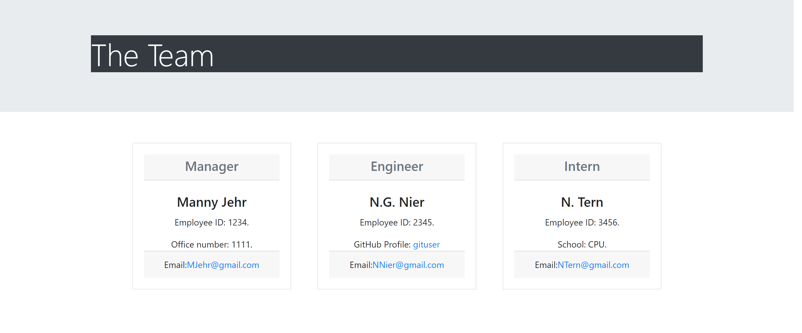

# Team Builder 
   
  ===========================================
    
  ## Description 
      This is a command-line application that collects and then displays employee information in the form of an html file.  Unit tests were developed to test each section, aiding in the building and maintainence of the code.    
  ## Table of Contents 
  - [Installation](#installation)
  - [Usage](#usage)
  - [Contributions](#contributions)
  - [Tests](#tests)
  - [Questions](#questions)
  - [License](#license)
  ## Installation 
      To install this application, run npm install in the folder containing this repository.
  ## Usage 
      Invoke the app using node index.js.  Answer the following prompts using information about each staff member. When all the employees have been entered, select the option for "finish entering team members".  The resulting HTML file will be located in the dist folder.  

View this [video](https://drive.google.com/file/d/1a8WN4Av4TBcttJWncOLqE1Fqeuh_tAup/view) as an example. 

  ## Contributions 
      This was created by:
* kellyjohnson364: [https://github.com/kellyjohnson364](https://github.com/kellyjohnson364)
            
            
            
         
           

  ## Tests
      Jest testing was used to test the routes for each class created for the app.  To run these tests, use 'npm run test'. These tests ensure that the app is working correctly. 

  ## Questions 
If you have questions or feedback, please contact kellyjohnson364 at [https://github.com/kellyjohnson364](https://github.com/kellyjohnson364) or via email at KJ3641402@gmail.com.

## License
This project is licensed under The Unlicense.
For more info click [The Unlicense](./assets/licenses/theunlicense.md).